# 1_2 SLEAP Processing

## Workflow

1. **Set data path and eye assignment (Cell 2)**  
   Set `data_path` to the experiment session folder (e.g. `B6J2782-2025-04-28T14-22-03`). Set `video1_eye` to `"L"` or `"R"` depending on which eye `VideoData1` records. The notebook expects that SLEAP has already been run on the session and that the `.sleap.csv` output files are present inside `data_path`.

2. **Adjust parameters if needed (Cell 2)**  
   Most parameters can be left at their defaults for a first pass. The most commonly adjusted are:
   - `blink_instance_score_threshold` — increase if too many false blinks; decrease if real blinks are missed.
   - `score_cutoff` — lower only if SLEAP inference quality is generally poor.
   - `outlier_sd_threshold` — raise if legitimate fast eye movements are being removed as outliers.
   - `pupil_filter_cutoff_hz` — lower to remove more noise from pupil diameter; raise to preserve faster dynamics.

3. **Run all cells in order**  
   Execute Cell 0 through the final save cell. Cells run sequentially; each depends on variables set by the previous ones.

4. **Inspect QC plots**  
   - **XY coordinate distributions (raw):** check that point clouds are compact and sensibly located. Outliers appear as isolated scatter far from the main cluster.
   - **Instance score histogram:** verify the chosen blink threshold sits in the valley between the low-score (blink) and high-score (open eye) modes.
   - **XY coordinate distributions (post-interpolation):** confirm that outliers are gone and the cloud is clean.
   - **Summary QC figure (`Eye_data_QC.pdf/png`):** review time-series traces, 2D scatter of raw vs. ellipse-fitted centre, pupil diameter comparison, and Ellipse.Center.X correlation between eyes.
   - If `plot_QC_timeseries = True`, additional interactive browser plots open for detailed inspection.

5. **Outputs are saved automatically**  

```mermaid
flowchart TD
    A["Cell 0\nEnvironment setup"] --> B["Cell 1\nImports + helper functions"]
    B --> C["Cell 2\nSet parameters & load SLEAP CSVs"]
    C --> D["Cell 3\nQC: raw XY coordinate distributions"]
    D --> E["Cell 4\nCenter coords, filter low-confidence,\nremove outliers, interpolate NaN"]
    E --> F["Cell 5\nInstance score distribution &\nblink threshold computation"]
    F --> G["Cell 6\nBlink detection\n(NaN-mask blink periods)"]
    G --> H["Cell 7\nQC: post-interpolation timeseries\n(optional)"]
    H --> I["Cell 8\nQC: post-interpolation XY distributions"]
    I --> J["Cell 9\nEllipse fitting → pupil diameter & angle"]
    J --> K["Cell 10\nButterworth filter on pupil diameter"]
    K --> L["Cell 11\nCross-correlate pupil diameter\n(left vs right)"]
    L --> M["Cell 12\nMerge ellipse data into VideoData"]
    M --> N["Cell 13\nCompare SLEAP centre vs ellipse centre;\nre-centre Ellipse.Center"]
    N --> O["Cell 14\nSummary QC figure → PDF + PNG"]
    O --> P["Cell 15\nInteractive QC timeseries\n(optional, browser)"]
    P --> Q["Cell 16\nSave outputs:\nparquet + metadata JSON"]
```

   On the final cell the notebook writes all outputs to `<data_path>_processedData/downsampled_data/`. Downstream notebooks (`1_3_saccade_detection.ipynb`) load these files directly.

---

## Prerequisites

- `1_1_Loading_and_Sync` must have been run for the session so that HARP/aeon timestamps are available.
- SLEAP must have been run on both `VideoData1` and `VideoData2` video files. Output CSVs must follow the naming convention `VideoData1_1904-01-01T00-00-00.sleap.csv` (timestamp may vary; the notebook sorts files chronologically by the embedded timestamp).
- Manual blink annotation CSVs are optional. If present, they are loaded automatically and used to validate automated blink detection.

---

## Input Parameters

All parameters are defined in **Cell 2**. Defaults are shown as used in a typical session.

### General settings

| Parameter | Default | Description | Tuning notes |
|-----------|---------|-------------|--------------|
| `data_path` | *(must be set)* | Full path to the experiment session folder. | Change for every session. |
| `video1_eye` | `"L"` | Which eye does `VideoData1` record? `"L"` = left, `"R"` = right. `video2_eye` is assigned automatically as the other eye. | Check your camera setup. |
| `debug` | `True` | Print verbose diagnostic output and extra per-step plots throughout the notebook. | Set to `False` for faster, quieter runs when the pipeline is well-tuned. |
| `plot_QC` | `True` | Generate and display static matplotlib QC figures (XY distributions, summary). | Set to `False` to skip all QC plots entirely (e.g. in batch mode). |
| `plot_QC_timeseries` | `False` | Open interactive Plotly timeseries plots in the browser (raw coordinates and post-processing). Heavy for long sessions. | Enable only when you need to inspect a specific session's traces in detail. |

### SLEAP raw data filtering

| Parameter | Default | Description | Tuning notes |
|-----------|---------|-------------|--------------|
| `score_cutoff` | `0.2` | Per-point inference confidence threshold. Points with score below this are treated as unreliable and replaced by linear interpolation. | Raise (e.g. to `0.3–0.4`) for noisy tracking. Lower only if SLEAP quality is generally high and you are discarding too much valid data. |
| `max_low_confidence_interpolation_fraction` | `0.05` | If more than this fraction of coordinate values require low-confidence interpolation for a given video, that eye is excluded from all downstream processing. | Raise cautiously (e.g. to `0.1`) only if a useful eye is being excluded. A high interpolation burden usually indicates a tracking quality problem that should be fixed upstream. |
| `outlier_sd_threshold` | `10` | After low-confidence filtering, coordinate values more than this many SDs from the mean are flagged as outliers and replaced by interpolation. | Lower (e.g. to `5–7`) to catch moderate outliers in noisy recordings. Raise if fast saccades are being incorrectly removed. |

### Pupil diameter filtering

| Parameter | Default | Description | Tuning notes |
|-----------|---------|-------------|--------------|
| `pupil_filter_cutoff_hz` | `10` | Cutoff frequency (Hz) for the Butterworth low-pass filter applied to the ellipse-fitted pupil diameter signal. | Lower (e.g. `5–8 Hz`) to remove more noise from pupil traces. Raise if you need to preserve rapid diameter transients. |
| `pupil_filter_order` | `6` | Order of the Butterworth filter. Higher order = steeper roll-off. | Rarely needs changing. Reduce to `4` if you observe ringing artefacts near blink edges. |

### Blink detection — threshold

These parameters control how the `instance.score` distribution is analysed to set a blink threshold. A low `instance.score` indicates the SLEAP model had low confidence in its pose estimate for that frame, which typically corresponds to a blink or eye occlusion.

| Parameter | Default | Description | Tuning notes |
|-----------|---------|-------------|--------------|
| `blink_instance_score_threshold` | `3.8` | Hard fallback threshold: frames with `instance.score` below this are classified as blinks. Also acts as the ceiling when `adaptive_blink_allow_upward = False`. | Increase if non-blink frames are being flagged; decrease if real blinks are missed. Inspect the instance score histogram (Cell 5 output) to guide adjustment. |
| `use_adaptive_blink_threshold` | `True` | When `True`, the notebook attempts to find the threshold automatically from the score distribution (valley between modes) rather than always using the hard value. | Set to `False` to use `blink_instance_score_threshold` exactly as specified. |
| `adaptive_blink_method` | `"histogram_valley"` | Method for adaptive threshold detection. `"histogram_valley"` finds the valley between the low-score (blink) and high-score (open) peaks. Falls back to a percentile method if no clear valley is found. | Only change if histogram valley consistently fails on your data. |
| `adaptive_blink_allow_upward` | `False` | If `False` (recommended), the adaptive threshold can only lower the hard threshold, never raise it. If `True`, the adaptive result can exceed the hard threshold. | Keep `False` to ensure the hard threshold acts as a conservative ceiling. Set to `True` only if you want the adaptive method to have full freedom. |
| `adaptive_blink_percentile` | `5.0` | Fallback: if the histogram valley method fails, the threshold is set at this percentile of the score distribution. | Adjust if the percentile fallback is landing in the wrong place for your data. |
| `adaptive_blink_min_peak_separation` | `1.0` | Minimum distance (in score units) required between the low-score and high-score peaks for the valley method to be considered valid. | Lower if two peaks exist but are close together and being rejected. |
| `adaptive_blink_min_low_fraction` | `0.0005` | Quality gate: the fraction of frames below the candidate threshold must be at least this large for the valley result to be accepted. Guards against spurious near-zero thresholds. | Lower only if sessions have extremely few blinks. |
| `adaptive_blink_max_low_fraction` | `0.2` | Quality gate: the fraction of frames below the candidate threshold must not exceed this. Guards against a threshold that captures too much valid data. | Raise if animals blink very frequently and legitimate thresholds are being rejected. |
| `blink_threshold_min` | `2.5` | Hard lower clamp for the adaptive threshold. The threshold will never go below this value regardless of the adaptive result. | Lower only if you have good reason to expect valid scores below 2.5. |
| `blink_threshold_max` | `4.5` | Hard upper clamp for the adaptive threshold. | Raise if animal eyes are typically very well tracked and scores cluster high. |

### Blink detection — temporal

| Parameter | Default | Description | Tuning notes |
|-----------|---------|-------------|--------------|
| `min_blink_duration_ms` | `50` | Blink segments shorter than this (in milliseconds) are classified as short blinks and kept separate from the main blink list, but are still included in the full export. | Lower to capture very brief closures. Raise to suppress short noise transients. |
| `blink_merge_window_ms` | `100` | **Not currently used.** Originally a window for merging nearby blink segments; removed to preserve valid data between separate blinks. | Do not change. |
| `long_blink_warning_ms` | `2000` | Blinks longer than this (in ms) trigger a printed warning prompting manual verification. | Adjust to match the expected maximum physiological blink duration for your animal model. |

### Resampling

| Parameter | Default | Description | Tuning notes |
|-----------|---------|-------------|--------------|
| `COMMON_RESAMPLED_RATE` | `1000` | Target resampling rate (Hz) used to bring the ~60 Hz video data onto a common time grid for alignment with other modalities (photometry, HARP streams, etc.). | Match to the sampling rate used in other processing notebooks in your pipeline. Changing this requires corresponding adjustments in downstream notebooks. |

---

## Outputs

All outputs are written to `<data_path>_processedData/` and its subdirectories.

| File | Location | Description |
|------|----------|-------------|
| `VideoData1_resampled.parquet` | `downsampled_data/` | Full processed VideoData1 data resampled to `COMMON_RESAMPLED_RATE` Hz. Contains `Seconds`, `Ellipse.Center.X`, `Ellipse.Center.Y`, `Pupil.Diameter`, `blink_flag`, `frame_idx`, and remaining SLEAP columns. Index is `aeon_time` (DatetimeIndex). |
| `VideoData2_resampled.parquet` | `downsampled_data/` | Same as above for VideoData2. |
| `saccade_input_metadata.json` | `downsampled_data/` | JSON with session metadata: `data_path`, `video1_eye`/`video2_eye`, `FPS`, `common_resampled_rate_hz`, output file paths, `eye_with_least_low_confidence`, low-confidence counts and percentages, and any excluded eyes. Read by `1_3_saccade_detection.ipynb`. |
| `Eye_data_QC.pdf` | `QC_and_debug/` | Summary QC figure (editable vector format): centre-X timeseries, 2D centre distributions, pupil diameter comparison, Ellipse.Center.X correlation. |
| `Eye_data_QC.png` | `QC_and_debug/` | Same QC figure at 600 dpi PNG. |
| `blink_detection_VideoData1.csv` | `QC_and_debug/` | Per-blink table for VideoData1: `blink_number`, `first_frame`, `last_frame`, `matches_manual`. Only written if blinks were detected. |
| `blink_detection_VideoData2.csv` | `QC_and_debug/` | Same for VideoData2. |
| `blink_detection_QC.txt` | `QC_and_debug/` | Full captured console output from the blink detection cell. Useful for offline review. |
| `Eye_data_QC_time_series.html` | `QC_and_debug/` | Interactive Plotly timeseries HTML (only written if `plot_QC_timeseries = True`). |

---

## Cell-by-Cell Description

### Cell 0 — Environment setup (Linux/macOS guard)

Sets OS-specific environment variables before any imports. On Linux, sets `MPLBACKEND=Agg` and `QT_QPA_PLATFORM=offscreen` to prevent display errors in headless environments. On macOS/Windows, no changes are made. This cell must run first.

---

### Cell 1 — Imports and helper functions

Imports all required libraries (`numpy`, `pandas`, `scipy`, `matplotlib`, `plotly`, `harp_resources.process`, `aeon.io.api`, `sleap.load_and_process`). Defines several helper functions used throughout the notebook:

- `resample_video_dataframe()` — resamples a SLEAP dataframe to `COMMON_RESAMPLED_RATE` Hz using the harp_resources resampler, handling SLEAP column naming conventions.
- `set_aeon_index()` / `append_aeon_time_column()` — convert `Seconds` to a `DatetimeIndex` based on the Aeon epoch (1904-01-01).
- `compute_blink_instance_score_threshold()` — computes the per-video adaptive blink threshold from the instance score distribution using histogram valley detection with robust fallbacks.
- `add_blink_flag_column()` — stamps a binary `blink_flag` column onto a dataframe given a list of blink segment dicts.

The `force_reload_modules` flag (default `False`) can be set to `True` to reload the `sleap` submodules without restarting the kernel — useful during development of those modules.

**Produces:** helper functions in the notebook namespace, `_SLEAP_EYE_PREFIXES`, `RESAMPLED_DROP_COLUMNS`.

---

### Cell 2 — Parameter setup and data loading

**This is the main cell to edit before running a session.**

Sets all user-facing parameters (see [Input Parameters](#input-parameters) section above). Derives `video2_eye` automatically from `video1_eye`. Constructs `save_path` and `qc_debug_dir` and creates them if they do not exist.

Calls `lp.load_videography_data()` to:
- Find all `VideoData1_*.sleap.csv` and `VideoData2_*.sleap.csv` files in `data_path`.
- Sort them chronologically by the embedded timestamp.
- Concatenate multi-chunk files (multiple CSV files per camera) with frame index alignment and dropped-frame gap filling.
- Return `VideoData1`, `VideoData2` dataframes plus boolean flags `VideoData1_Has_Sleap`, `VideoData2_Has_Sleap`.

Also calls `lp.load_manual_blinks()` for each video. If manual blink annotation CSVs exist in `data_path`, they are loaded as `manual_blinks_v1` / `manual_blinks_v2`; otherwise these variables are `None`.

Extracts `columns_of_interest` coordinate columns, drops the empty `track` column if present, computes FPS from the median frame interval, and builds `coordinates_dict1_raw` / `coordinates_dict2_raw` (dictionaries of raw coordinate arrays by column name).

**Key parameters set here:** all parameters listed in [Input Parameters](#input-parameters).  
**Produces:** `VideoData1`, `VideoData2`, `VideoData1_Has_Sleap`, `VideoData2_Has_Sleap`, `FPS_1`, `FPS_2`, `coordinates_dict1_raw`, `coordinates_dict2_raw`, `manual_blinks_v1`, `manual_blinks_v2`, `save_path`, `qc_debug_dir`.

---

### Cell 3 — QC: raw XY coordinate distributions (optional)

**Gated by:** `plot_QC = True`

Plots a 2×2 grid of scatter plots showing the raw XY coordinate distributions for all SLEAP-tracked points before any filtering or interpolation:
- Top row: VideoData1 — (left) left/center/right eye corner points; (right) iris points p1–p8.
- Bottom row: same for VideoData2.

All panels share the same axis limits, computed from the global min/max across both videos. This plot is the first quality check — compact, well-separated point clouds indicate good SLEAP tracking; spread-out or shifted clouds indicate problems.

**Reads:** `coordinates_dict1_raw`, `coordinates_dict2_raw`.

---

### Cell 4 — Coordinate centering, low-confidence filtering, outlier removal, and interpolation

This is the core data cleaning cell. It runs three sequential steps for each video:

**Step 1 — Confidence score analysis (debug only):**  
Calls `lp.analyze_confidence_scores()` to print per-point score statistics. Shows the fraction of frames below `score_cutoff` for each tracked point.

**Step 2 — Coordinate centering:**  
Calls `lp.center_coordinates_to_median()` to subtract the median pupil centre from all coordinates, producing `VideoData1_centered` / `VideoData2_centered`. This centred copy is used later only for visualization in the summary QC plot; the original `VideoData1`/`VideoData2` continue through the pipeline uncentred.

**Step 3 — Low-confidence filtering:**  
Calls `lp.filter_low_confidence_points()`. For each tracked point, frames where that point's `.score` is below `score_cutoff` have their X/Y values set to `NaN` (to be interpolated). Records the total number of low-confidence coordinate values. If the fraction exceeds `max_low_confidence_interpolation_fraction`, that video's `Has_Sleap` flag is set to `False` and it is excluded from all further processing with a warning.

**Step 4 — Outlier removal and interpolation:**  
Calls `lp.remove_outliers_and_interpolate()`. Coordinate values more than `outlier_sd_threshold` SDs from the mean are set to `NaN`. All `NaN` values (skipped frames, low-confidence points, outliers) are then filled by linear interpolation.

After both videos are processed, determines `eye_with_least_low_confidence` (the eye with fewer interpolated points, with ties resolving to VideoData2 by convention). Sets `NaNs_removed = True` to prevent re-running if the cell is executed again.

**Reads:** `VideoData1`, `VideoData2`, `score_cutoff`, `max_low_confidence_interpolation_fraction`, `outlier_sd_threshold`, `debug`.  
**Produces:** `VideoData1` (cleaned, in-place), `VideoData2` (cleaned, in-place), `VideoData1_centered`, `VideoData2_centered`, `low_confidence_results_v1/v2`, `outlier_results_v1/v2`, `eye_with_least_low_confidence`, `NaNs_removed = True`.

---

### Cell 5 — Instance score distribution and blink threshold computation

Prints a summary of the blink threshold mode (`hard`, `adaptive`, or `adaptive-down-only`). For each available video, calls `compute_blink_instance_score_threshold()` (defined in Cell 1) using all the `adaptive_blink_*` parameters to compute a per-video threshold. The adaptive method fits a histogram of `instance.score` values and finds the valley between the blink and open-eye peaks; falls back to a percentile if the valley cannot be reliably identified.

Calls `lp.plot_instance_score_distributions_combined()` to display a combined histogram for both videos with the applied thresholds marked as vertical lines. Calls `lp.analyze_instance_score_distribution()` for verbose statistics including estimated total blink time.

**Reads:** `VideoData1`, `VideoData2`, all `blink_instance_score_threshold`, `use_adaptive_blink_threshold`, `adaptive_blink_*` parameters.  
**Produces:** `blink_thresholds` dict (`{"VideoData1": float, "VideoData2": float}`).

---

### Cell 6 — Blink detection

Uses the per-video thresholds from Cell 5 to detect blinks. For each video, calls `lp.detect_blinks_for_video()`:
- Frames where `instance.score` is below the threshold are grouped into segments.
- Segments shorter than `min_blink_duration_ms` are classified as short blinks (kept in `all_blink_segments` but excluded from `blink_segments`).
- Adjacent segments within `merge_window_frames` (10 frames, hardcoded) are merged into blink bouts.
- Any manual blinks (`manual_blinks_v1/v2`) are merged in.
- Blinks longer than `long_blink_warning_ms` trigger a printed warning.
- The X/Y coordinates and ellipse columns for all detected blink frames are set to `NaN` (blinks are **not** interpolated — they remain as gaps in downstream data).

When both eyes are available, compares blink bout timing between videos: reports concurrent vs. independent bouts and timing offsets.

Saves blink detection results to `blink_detection_VideoData1.csv` / `VideoData2.csv` in `QC_and_debug/`. All console output is also saved to `blink_detection_QC.txt`.

**Reads:** `VideoData1`, `VideoData2`, `blink_thresholds`, `long_blink_warning_ms`, `debug`, `manual_blinks_v1/v2`.  
**Produces:** `blink_segments_v1/v2`, `short_blink_segments_v1/v2`, `blink_bouts_v1/v2`, `all_blink_segments_v1/v2`, `long_blinks_warnings_v1/v2`. Updates `FPS_1`, `FPS_2` with values calculated during detection.

---

### Cell 7 — QC: post-interpolation timeseries (optional)

**Gated by:** `plot_QC_timeseries = True`

Opens interactive Plotly figures in the browser for each video with 4 subpanels (X and Y of corner points; X and Y of iris points p1–p8), all sharing a common time axis. This is the post-interpolation version — it shows the effect of the outlier removal and NaN-filling from Cell 4. Blink windows are now visible as flat-line gaps. Useful for detailed visual inspection of signal quality over the full session, but slow for long recordings.

---

### Cell 8 — QC: post-interpolation XY distributions

**Gated by:** `plot_QC = True`

Regenerates the same 2×2 scatter plot format as Cell 3, but now using the cleaned, interpolated coordinates. Comparing this plot against the Cell 3 output confirms that outliers have been successfully removed. Remaining dense clusters show the natural variability of head/eye position during the session.

**Reads:** `VideoData1`, `VideoData2` (post-interpolation).  
**Produces:** `coordinates_dict1_processed`, `coordinates_dict2_processed`.

---

### Cell 9 — Ellipse fitting for pupil diameter and angle

For each available video, fits an ellipse to the 8 iris landmark points (p1–p8) on each frame using `lp.get_fitted_ellipse_parameters()`. The pipeline before fitting:
1. Finds the horizontal axis angle `theta` from the left–center point vector (`lp.find_horizontal_axis_angle()`).
2. Centres all coordinates to the median left–right–center centroid (`lp.get_centered_coordinates_dict()`).
3. Rotates coordinates so the horizontal axis is aligned (`lp.get_rotated_coordinates_dict()`).
4. Fits the ellipse per frame in the rotated frame.

From the fitted ellipse, extracts:
- `Ellipse.Diameter` — average of the ellipse major and minor axes (in pixels), used as a proxy for pupil diameter.
- `Ellipse.Angle` — ellipse tilt angle.
- `Ellipse.Center.X`, `Ellipse.Center.Y` — ellipse centre coordinates.

Packages these into `SleapVideoData1` / `SleapVideoData2` dataframes. Then applies a Butterworth low-pass filter (`pupil_filter_cutoff_hz`, `pupil_filter_order`) to produce `Ellipse.Diameter.Filt`. Blink-period NaN values are temporarily filled for filtering, then restored afterwards so blinks remain as gaps.

**Reads:** `VideoData1`, `VideoData2`, `pupil_filter_cutoff_hz`, `pupil_filter_order`.  
**Produces:** `SleapVideoData1`, `SleapVideoData2` (with `Ellipse.Diameter`, `Ellipse.Diameter.Filt`, `Ellipse.Angle`, `Ellipse.Center.X`, `Ellipse.Center.Y`).

> Note: Cell 9 in the notebook combines what is logically ellipse fitting (the first part) and Butterworth filtering (the second part) in a single code cell.

---

### Cell 10 — Pupil diameter cross-correlation

**Only runs if both `VideoData1_Has_Sleap` and `VideoData2_Has_Sleap` are `True`.**

Cross-correlates the filtered pupil diameter signals from the two eyes to assess bilateral consistency (both eyes should dilate/constrict together). Steps:
1. Truncates both signals to the same length.
2. Removes frames where either signal is `NaN` (blinks in either eye).
3. Z-score normalises both signals to account for different camera magnifications.
4. Computes the full cross-correlation (`scipy.signal.correlate`), finds the peak lag in seconds.
5. Computes the Pearson correlation coefficient and p-value.

Results (`pearson_r_display`, `pearson_p_display`, `peak_lag_time_display`) are displayed and later annotated on the summary QC figure.

**Reads:** `SleapVideoData1["Ellipse.Diameter.Filt"]`, `SleapVideoData2["Ellipse.Diameter.Filt"]`.  
**Produces:** `pearson_r_display`, `pearson_p_display`, `peak_lag_time_display`, `pearson_r_center`, `pearson_p_center`, `peak_lag_time_center`.

---

### Cell 11 — Merge ellipse data into VideoData

Verifies that the `Seconds` columns of `VideoData1`/`VideoData2` and `SleapVideoData1`/`SleapVideoData2` match exactly (1:1 row correspondence), then merges the ellipse columns into the main `VideoData` dataframes using an outer join on `Seconds`. Deletes the now-redundant `SleapVideoData*` variables and runs garbage collection. Also validates that `frame_idx` remains monotonic and unique after the merge.

**Reads:** `VideoData1`, `VideoData2`, `SleapVideoData1`, `SleapVideoData2`.  
**Produces:** `VideoData1`, `VideoData2` (now containing ellipse columns).

---

### Cell 12 — Compare SLEAP centre vs. ellipse centre; re-centre Ellipse.Center

Computes R² between the SLEAP-tracked `center.x/y` and the ellipse-fitted `Ellipse.Center.X/Y` for both X and Y axes separately using linear regression. If debug is enabled, also computes the centre-of-mass (mean) distance between the two centre estimates.

Then re-centres `Ellipse.Center.X` and `Ellipse.Center.Y` by subtracting their respective medians. This makes the ellipse centre coordinates session-relative (centred on the mean eye position) and comparable across sessions.

**Reads:** `VideoData1`, `VideoData2`, `debug`.  
**Produces:** `r_squared_x1/y1/x2/y2` (R² statistics), `dist_x1/y1/x2/y2` (centre-of-mass distances), `VideoData1["Ellipse.Center.X/Y"]` and `VideoData2["Ellipse.Center.X/Y"]` re-centred in-place.

---

### Cell 13 — Summary QC figure

Generates a 4-row matplotlib figure summarising the full processing pipeline for the session. The figure is saved as both an editable PDF and a 600 dpi PNG to `QC_and_debug/`.

Layout:
- **Row 1 (full width):** VideoData1 centre-X time series — raw SLEAP centre (blue) vs. re-centred ellipse centre (red).
- **Row 2 (full width):** Same for VideoData2.
- **Row 3 left:** VideoData1 2D scatter — SLEAP centre (red) vs. ellipse centre (blue). Annotated with R² for X and Y, and the centre-of-mass distance.
- **Row 3 right:** Same for VideoData2.
- **Row 4 left:** Pupil diameter comparison — filtered diameter timeseries for both eyes. Annotated with Pearson r, p-value, and peak cross-correlation lag from Cell 10.
- **Row 4 right:** Ellipse.Center.X comparison — both eyes on primary y-axis; normalized difference (z-score) on secondary y-axis. Annotated with Pearson correlation statistics.

**Gated by:** `plot_QC = True` for display; figure is always saved regardless.

---

### Cell 14 — Interactive QC timeseries (optional, browser)

**Gated by:** `plot_QC_timeseries = True`

Opens a 3-panel Plotly figure in the browser:
1. VideoData1 centre-X: raw SLEAP centre vs. ellipse centre.
2. VideoData2 centre-X: same.
3. Ellipse.Center.X comparison: both eyes on primary axis; normalized difference on secondary y-axis.

Also saves the figure as an interactive HTML file to `QC_and_debug/Eye_data_QC_time_series.html`.

---

### Cell 15 — Save processed outputs

The final data-writing cell. For each video with valid SLEAP data:

1. Adds a `blink_flag` column (binary: 1 = blink frame, 0 = valid) using all detected blink segments (including short blinks).
2. Renames `Ellipse.Diameter.Filt` to `Pupil.Diameter`.
3. Drops raw SLEAP coordinate and score columns that are not needed downstream (`RESAMPLED_DROP_COLUMNS`).
4. Resamples to `COMMON_RESAMPLED_RATE` Hz using `resample_video_dataframe()`.
5. Binarises the resampled `blink_flag` (any sample with interpolated value ≥ 0.5 becomes 1).
6. Sets a `DatetimeIndex` from `Seconds` (Aeon epoch) and saves to parquet (`VideoData1_resampled.parquet` / `VideoData2_resampled.parquet`).

Then writes `saccade_input_metadata.json` containing all session-level parameters and paths needed by `1_3_saccade_detection.ipynb`.

**Reads:** `VideoData1`, `VideoData2`, `all_blink_segments_v1/v2`, `video1_eye`, `video2_eye`, `COMMON_RESAMPLED_RATE`, all metadata variables.  
**Writes:** `downsampled_data/VideoData1_resampled.parquet`, `downsampled_data/VideoData2_resampled.parquet`, `downsampled_data/saccade_input_metadata.json`.
