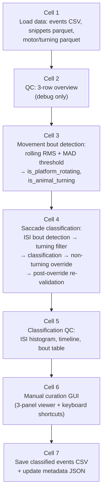
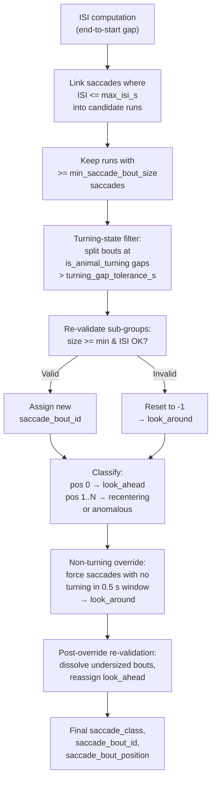

# 1_4 Saccade Classification

## Workflow

1. **Set data path (Cell 1)**  
   In Cell 1, set `data_path` to the experiment session folder (the same session used in `1_3_saccade_detection`). The notebook expects that `1_3` has already been run and that the curated outputs are present.

2. **Run all cells in order (Cell 1 through Cell 7)**  
   Cells depend on variables set by previous cells.

3. **Inspect movement-bout detection (Cell 3)**  
   Check the diagnostic figure:
   - **Row 1 histograms** — this is less informative, as the distribution is not bimodal. 
   - **Row 2 time series** — check the shaded turning (yellow) and rotation (red) timespans. Are there gaps in a long bout? Are small and short movements overdetected?
   - Adjust `rms_window_s`, `k_motor`, `k_turning`, `min_movement_bout_duration_s`, or `max_lag_s` as needed (see parameter table and tuning guide in Cell 3 comments).

4. **Check classification quality (Cell 5)**  
   Inspect the three QC outputs:
   - **Figure A** — ISI distribution histogram with the `max_isi_s` threshold. Adjust `max_isi_s` and `min_saccade_bout_size` if bouts are being over- or under-grouped.
   - **Figure B** — 3-row timeline showing snippets coloured by class (row 1), Motor_Velocity with rotation shading (row 2), and Velocity_0Y with turning shading (row 3). Saccade bout extents are marked with grey rectangles on row 1.
   - **Figure C** — Per-bout summary table in the console showing bout size, majority direction, and class counts.

5. **Manual curation (Cell 6)**  
   Use the interactive GUI to review and override automatic classifications:
   - **Events (W/Q):** step through individual saccades.
   - **Bouts (K/J):** jump to the first event of the next/previous saccade bout.
   - **Classify (1–5):** override the class for the current event (1=look_around, 2=look_ahead, 3=recentering, 4=anomalous, 5=no_saccade).
   - The 3-panel viewer shows X position (snippet), Motor_Velocity, and Velocity_0Y for a ±5 s window around the saccade peak, with rotation/turning shading and bout extent rectangles.

6. **Save (Cell 7)**  
   Click **Save classified events**. This writes the classified events CSV and updates the metadata JSON.

---

## Prerequisites

- **Run `1_3_saccade_detection.ipynb` first** for the session. It produces:
  - `curated_saccade_events.csv` — curated saccade events with timing, direction, and amplitude columns.
  - `curated_saccade_snippets.parquet` — ±5 s X-position traces around each saccade peak.
  - `saccade_input_metadata.json` — session metadata and detection parameters.
- **Run `1_1_Loading_and_Sync` first** so that `photometry_tracking_encoder_data.parquet` (Motor_Velocity and Velocity_0Y) is available.

---

## Input

| Variable | Location | Description |
|----------|----------|-------------|
| `data_path` | Cell 1 | Path to the experiment session folder. Must match the session used in `1_3`. |
| `debug` | Cell 1 | If `True`, prints verbose diagnostics and shows the Cell 2 QC figure. |

### Cell 3 — Movement bout detection parameters

| Parameter | Default | Description | Tuning notes |
|-----------|---------|-------------|--------------|
| `rms_window_s` | `1` | Rolling RMS integration window (seconds). | Increase (0.7–1.0 s) to smooth over brief baseline oscillations; decrease for sharper bout edges. |
| `k_motor` | `4.0` | MAD multiplier for Motor_Velocity threshold. | Lower to detect weaker rotation bouts; raise to reduce false positives. |
| `k_turning` | `4.5` | MAD multiplier for Velocity_0Y threshold. | Lower to detect weaker turning bouts; raise to reduce false positives. |
| `min_movement_bout_duration_s` | `0.5` | Minimum duration (s) for a movement bout; shorter runs are removed. | Increase to merge fragmented bouts; decrease to preserve short bouts. |
| `max_lag_s` | `1.0` | Cross-validation: max delay (s) between turn onset and motor response. Turning bouts without motor activity within this window are rejected as false positives. | Increase if valid bouts are being rejected due to hardware lag; decrease if unrelated bouts are being linked. |

### Cell 4 — Saccade bout detection and classification parameters

| Parameter | Default | Description | Tuning notes |
|-----------|---------|-------------|--------------|
| `min_saccade_bout_size` | `2` | Minimum number of saccades to form a saccade bout. Groups smaller than this are classified as `look_around`. | Raise to require larger bouts. |
| `max_isi_s` | `6.0` | Maximum inter-saccade interval (s) to link consecutive saccades into a bout. Measured from `aeon_end_time[i]` to `aeon_start_time[i+1]`. | Lower for stricter grouping; raise to allow wider gaps. |
| `turning_gap_tolerance_s` | `0.5` | Turning-state filter: maximum allowed gap (s) in `is_animal_turning` within a saccade bout. Gaps longer than this split the bout. | Increase to tolerate brief turning dropouts; decrease for stricter turning continuity. |

---

## Pipeline



---

## Cell-by-Cell Description

### Cell 1 — Data path and loading

Sets `data_path`, derives `save_path`, `downsampled_dir`, and `classification_output_dir`. Loads three datasets:

1. **`curated_saccade_events.csv`** — curated saccade events from `1_3`. Indexed on `aeon_time` (naive datetime). Contains columns: `direction`, `aeon_start_time`, `aeon_end_time`, `duration`, `amplitude`, `TNT_direction`, `time`, `velocity`, etc.
2. **`curated_saccade_snippets.parquet`** — ±5 s X-position traces around each saccade peak. Indexed on `aeon_time`. Contains `event_idx`, `time_rel`, `X_raw`, `frame_idx`.
3. **`photometry_tracking_encoder_data.parquet`** — loads `Motor_Velocity` and `Velocity_0Y` columns. DatetimeIndex at ~100 Hz.

Prints a loading summary. If `debug=True`, displays the head of each DataFrame.

**Produces:** `saccade_events_df`, `saccade_snippets_df`, `turning_df`, `data_path`, `save_path`, `downsampled_dir`, `classification_output_dir`.

---

### Cell 2 — QC overview (debug only)

**Gated by:** `debug = True`

Computes a global reference time `t0` (earliest timestamp across snippets and turning data). Displays a 3-row Plotly figure:

- **Row 1:** All saccade snippets (X_raw) coloured by `TNT_direction` (green = NT, purple = TN).
- **Row 2:** Motor_Velocity (decimated to ~30k points).
- **Row 3:** Velocity_0Y (decimated).

All rows share a relative-time x-axis (seconds from `t0`).

**Produces:** `t0` (always computed, regardless of debug flag).

---

### Cell 3 — Movement bout detection and QC plots

Detects two independent movement states from the continuous motor and velocity signals:

**Algorithm:**
1. Compute centered rolling RMS of each signal over `rms_window_s`.
2. Apply a robust adaptive threshold: `median(RMS) + k * MAD(RMS) / 0.6745`.
3. Clean up with `remove_short_runs()` — removes active runs and fills inactive gaps shorter than `min_movement_bout_duration_s`.
4. Cross-validate turning bouts: any `is_animal_turning` bout without corresponding `is_platform_rotating` activity within `max_lag_s` is rejected as a false positive.

**Outputs added to `turning_df`:**
- `is_platform_rotating` (bool) — True when the platform is physically rotating.
- `is_animal_turning` (bool) — True when the animal is self-locomoting (turning the ball).

**Helper functions defined:**
- `rolling_rms()` — centered rolling RMS energy envelope.
- `mad_threshold()` — robust adaptive threshold from the RMS distribution.
- `remove_short_runs()` — morphological cleanup of boolean state arrays.
- `reject_unmatched_turns()` — cross-validation: remove turning bouts with no motor response.
- `_state_runs_to_shapes()` — convert boolean state arrays to Plotly rect shapes for shading.

**Diagnostic figure** (always shown): 3-row layout with RMS distribution histograms (row 1), dual-axis time series with RMS overlaid (row 2), and saccade snippets with rotation/turning shading (row 3).

**Produces:** `turning_df` (with `is_platform_rotating`, `is_animal_turning`), `_dt_s` (sampling interval), helper functions.

---

### Cell 4 — ISI-based bout detection and saccade classification

This is the core classification cell. It runs five sequential stages:

#### Stage 1: ISI computation

Computes `isi_before_s` and `isi_after_s` for each saccade as the gap from `aeon_end_time[i]` to `aeon_start_time[i+1]` (and vice versa). These columns are added to the events DataFrame.

#### Stage 2: Saccade bout detection

Links consecutive saccades whose ISI is within `max_isi_s` into runs. Runs with at least `min_saccade_bout_size` saccades become saccade bouts. Each saccade is assigned a `saccade_bout_id` (0-based sequential) and `saccade_bout_position` (0 = first in bout). Non-bout saccades receive `-1` for both fields.

#### Stage 3: Turning-state filter

For each ISI-detected saccade bout, queries `is_animal_turning` across the bout's time span. If any contiguous `False` run exceeds `turning_gap_tolerance_s`, the bout is split at that gap. The resulting sub-groups are re-validated:
- Sub-groups meeting `min_saccade_bout_size` and ISI criteria receive new sequential `saccade_bout_id` values.
- Sub-groups that are too small or have broken ISI chains have their saccades reset to `saccade_bout_id = -1` (classified as `look_around`).

Skipped with a warning if `is_animal_turning` is absent from `turning_df`.

#### Stage 4: Classification

Applies the class labels based on bout structure:
- **`look_around`**: saccade not in any bout (`saccade_bout_id == -1`).
- **`look_ahead`**: first saccade in a bout (position 0).
- **`recentering`**: positions 1..N in a bout, matching the majority `TNT_direction` (computed from positions 1..N only, excluding the look-ahead).
- **`anomalous`**: positions 1..N in a bout, opposing the majority direction.
- Tie-breaking: if NT and TN counts are equal, the direction of position 1 wins.

#### Stage 5: Non-turning override

A post-classification pass that checks a 0.5-second window after each saccade peak. If `is_animal_turning` is `False` throughout that window, the saccade is forced to `look_around` with `saccade_bout_id = -1` and `saccade_bout_position = -1`, regardless of its previous classification.

#### Stage 6: Post-override re-validation

After the non-turning override may have removed saccades from bouts, this pass:
1. Dissolves bouts that have shrunk below `min_saccade_bout_size` — all their saccades become `look_around`.
2. Re-numbers `saccade_bout_position` contiguously for surviving bouts.
3. Re-classifies: position 0 becomes `look_ahead`; positions 1..N get `recentering`/`anomalous` via the same majority-direction logic.

#### Summary output

Prints a summary to console:
```
── Saccade classification ──────────────────────────────────────────
   Parameters : min_saccade_bout_size=2, max_isi_s=6.0 s
   Total events : N
   Saccade bouts detected : M
   Saccade bout size : mean=X, median=Y, min=Z, max=W
   Turning-state filter  : A bout(s) split  |  B sub-group(s) kept  |  C saccade(s) reclassified as look_around  [gap_tolerance=500 ms]
   Non-turning override  : D saccade(s) forced to look_around
   Post-override reclass : E bout(s) dissolved  |  F look-ahead(s) reassigned

   look_around    :   XX  (YY.Y%)
   look_ahead     :   XX  (YY.Y%)
   recentering    :   XX  (YY.Y%)
   anomalous      :   XX  (YY.Y%)
```

**Produces:** `saccade_events_df` updated with columns: `isi_before_s`, `isi_after_s`, `saccade_bout_id`, `saccade_bout_position`, `saccade_class`.

---

### Cell 5 — Classification QC visualization

Three outputs:

**Figure A — ISI distribution:** Histogram of `isi_after_s` values (log x-axis) with a dashed line at `max_isi_s`. Shows the number of detected saccade bouts in the title.

**Figure B — 3-row timeline overview:**
- **Row 1:** Saccade snippets coloured by `saccade_class`, trimmed to the peri-saccade window (-0.5 s to +1.0 s relative to peak). Plotted in layered order for visibility: `recentering` (bottom), `look_around`, `look_ahead`, `anomalous`, `no_saccade` (top). Grey rectangles mark saccade bout extents.
- **Row 2:** Motor_Velocity with `is_platform_rotating` shading (red) and `is_animal_turning` shading (orange).
- **Row 3:** Velocity_0Y with the same rotation and turning shading.

**Figure C — Per-bout summary table:** Console-printed table showing for each saccade bout: bout ID, size, majority TNT direction, and counts of look-ahead, recentering, and anomalous saccades.

**Reads:** `saccade_events_df`, `saccade_snippets_df`, `turning_df`, classification parameters.

---

### Cell 6 — Manual classification curation GUI

Imports `build_classification_gui` from `sleap/saccade_classification_gui.py` and constructs the interactive viewer. Passes `saccade_events_df`, `saccade_snippets_df`, `turning_df`, `t0`, and the classification parameters (`_cls_params` dict).

The GUI consists of:
- A 3-row `FigureWidget` (X position snippet, Motor_Velocity, Velocity_0Y) showing a ±5 s window around the current saccade, with rotation/turning shading and bout extent rectangles.
- Navigation: buttons and keyboard shortcuts for event stepping (W/Q) and bout jumping (J/K).
- Classification: buttons and keyboard shortcuts (1–5) for the five classes.
- Info panels: event details (index, class, bout, direction, ISI) and a live summary of class counts and override counts.

**Produces:** `classification_widget` (for display), `classification_state` (a `ClassificationState` instance managing auto-classifications and manual overrides).

**Keyboard shortcuts:**

| Key | Action |
|-----|--------|
| **W** / **Q** | Next / previous event |
| **K** / **J** | Next / previous saccade bout |
| **1** | Classify as look_around |
| **2** | Classify as look_ahead |
| **3** | Classify as recentering |
| **4** | Classify as anomalous |
| **5** | Classify as no_saccade |

---

### Cell 7 — Save classified events

Provides a **Save classified events** button (`ipywidgets`). On click:
1. Loads `saccade_input_metadata.json` from `downsampled_dir`.
2. Calls `classification_state.save()`, which writes `classified_saccade_events.csv` to `classification_output_dir` and updates the metadata JSON with `classification_parameters` and `classification_summary`.

---

## Outputs

| File | Location | Description |
|------|----------|-------------|
| `classified_saccade_events.csv` | `<session>_processedData/saccade_classification/` | All curated saccade events with added columns: `saccade_class`, `saccade_bout_id`, `saccade_bout_position`, `isi_before_s`, `isi_after_s`. Events classified as `no_saccade` are retained for downstream filtering. |
| `saccade_input_metadata.json` | `<session>_processedData/downsampled_data/` | Updated in-place with `classification_parameters` (min_saccade_bout_size, max_isi_s, turning_gap_tolerance_s) and `classification_summary` (class counts, override count). |

---

## Classification Definitions

| Class | Definition |
|-------|-----------|
| `look_around` | Saccade not in any saccade bout, or occurring during a non-turning period. Isolated, exploratory eye movements. |
| `look_ahead` | First saccade (position 0) in a saccade bout. Anticipatory saccade at the start of a turning/recentering sequence. |
| `recentering` | Positions 1..N in a bout, going in the same direction as the bout's majority TNT direction. Compensatory saccades during sustained turning. |
| `anomalous` | Positions 1..N in a bout, going in the opposite direction to the bout's majority TNT direction. |
| `no_saccade` | Manual override only. Marks events that are not saccades (false positives from detection). Retained in output for downstream filtering. |

---

## Classification Algorithm



---

## Supporting Module

### `sleap/saccade_classification_gui.py`

Contains two main components:

- **`ClassificationState`** — manages the auto-assigned classifications from Cell 4 and any manual overrides. Provides methods: `get_class()`, `set_class()`, `n_events`, `n_saccade_bouts`, `saccade_bout_ids`, `summary_text`, `get_final_df()`, `save()`.
- **`build_classification_gui()`** — constructs the ipywidgets + FigureWidget interface. Returns `(widget, state)` where `widget` is the displayable VBox and `state` is the `ClassificationState` instance.
